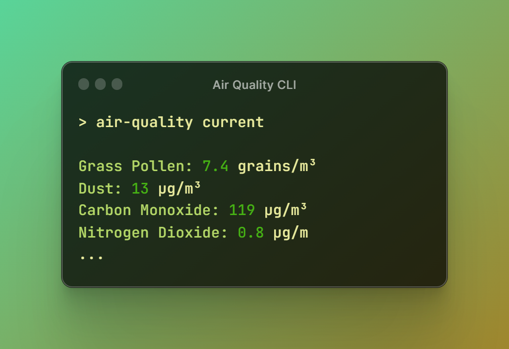

# 🍃 Air Quality CLI

<p align="center">
    
    <p align="center">
        <a href="https://github.com/mihaichris/air-quality-cli/actions"></a>
        <a href="https://app.codecov.io/gh/mihaichris/air-quality-cli"></a>
        <a href="https://github.com/mihaichris/air-quality-cli/issues"></a>
    </p>
</p>


# Description
 Air Quality CLI is a small CLI tool that is powered by [air-quality](https://github.com/mihaichris/air-quality) PHP package. Provide de coordinates of the location you want and retrieve the weather variables of that point location.

# 🚀 Installation

To install, do:
```bash
composer global require mihaichris/air-quality-cli
```

# Basic Usage

```powershell
# Get current air quality from Bucharest
air-quality.bat current latitude=44.38 longitude=26.14

# Get air quality from Bucharest between two dates
air-quality.bat between latitude=44.38 longitude=26.14 start_date=2023-05-26 end_date=2023-05-27

# Get forecast air quality from Bucharest
air-quality.bat next days=2 latitude=44.38 longitude=26.14
```

# 👨‍💻 Author
Mihai-Cristian Făgădău
 * Github: [@mihaichris](https://github.com/mihaichris)
 * LinkedIn: [in/mihai-fagadau](https://www.linkedin.com/in/mihai-fagadau/)
 * Website: [mihaifagadau.dev](https://mihaifagadau.dev)

# 🤝 Contributing
Contributing details can be found at [here](./CONTRIBUTING.md).

# 📝 License
This project is [MIT](https://opensource.org/licenses/MIT) licensed.
